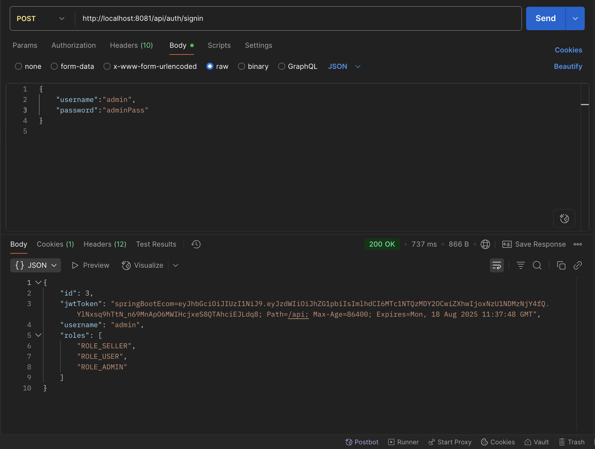
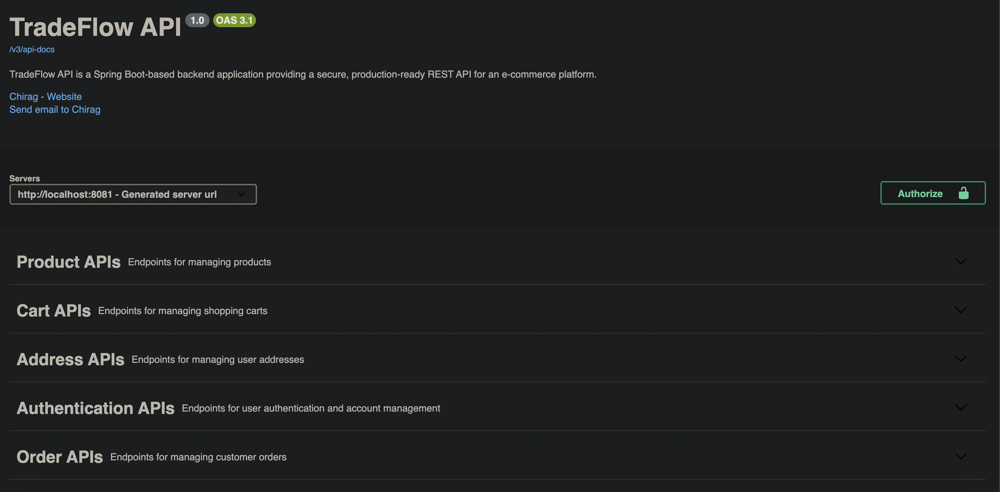
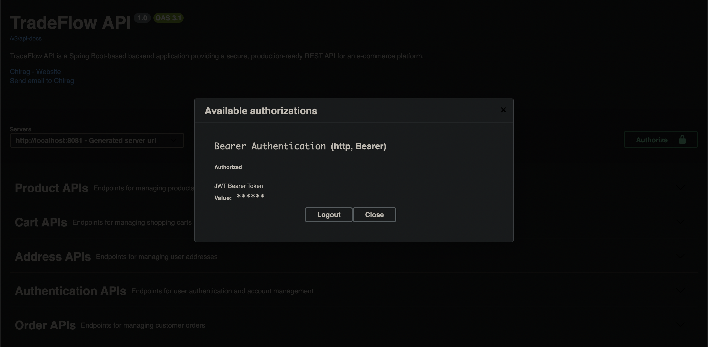
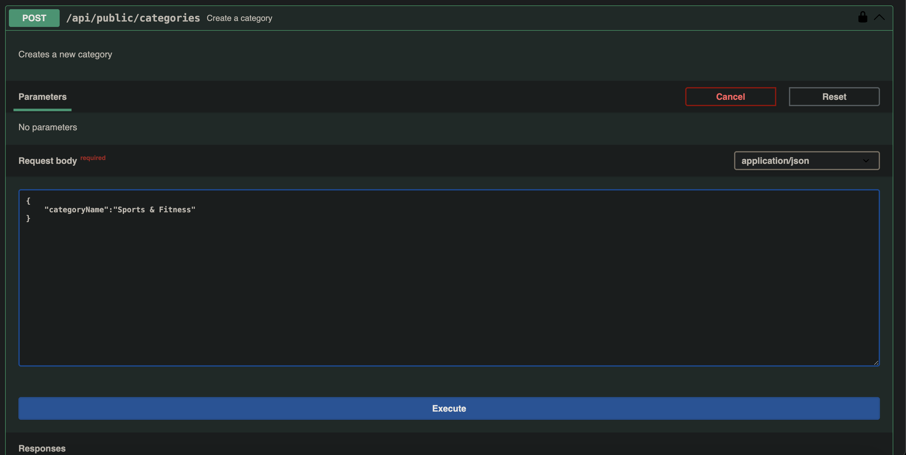
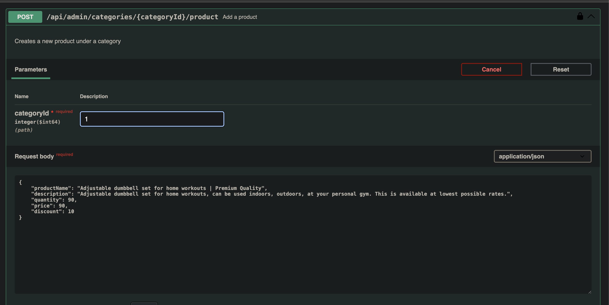
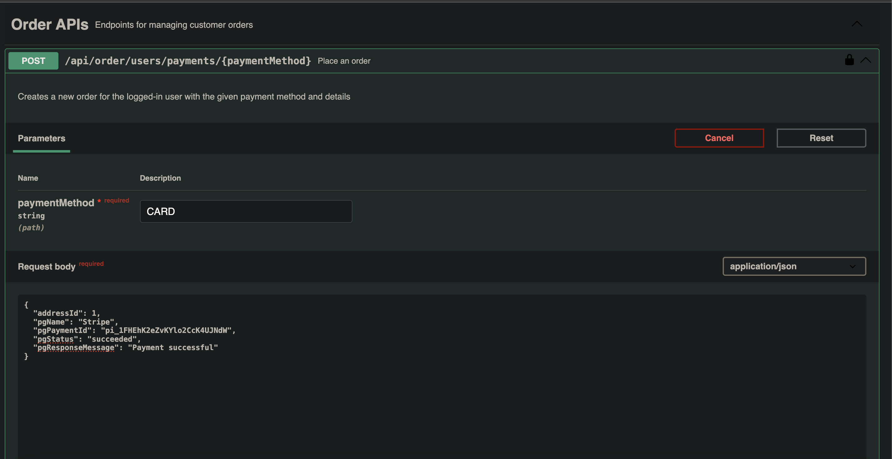
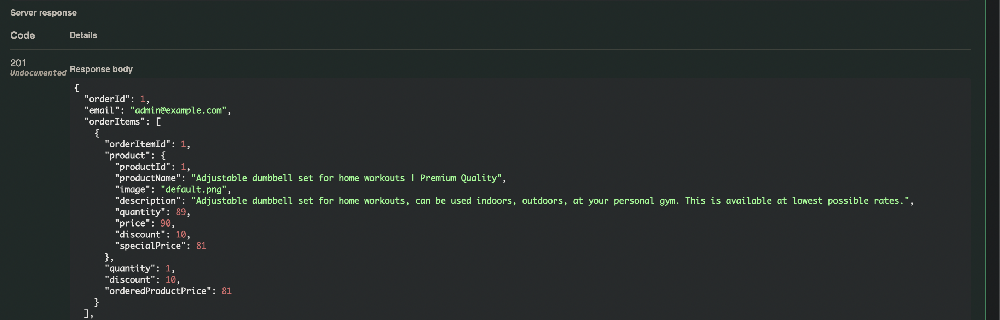

#  TradeFlow API

  
  
  
  


**TradeFlow** API is a Spring Boot-based backend application providing a secure, production-ready **REST API** for an e-commerce platform. It implements standard HTTP methods to manage products, categories, orders, payments, and user accounts.The API includes JWT-based security (stateless JSON Web Tokens for auth and role-based access via Spring Security. The service uses AWS Elastic Beanstalk for cloud deployment and Amazon RDS (MySQL) for the database.

## Table of Contents

* [Features](#features)
* [Tech Stack](#tech-stack)
* [Installation](#installation)
* [Production](#production)
* [Usage](#usage)
* [Screenshots](#screenshots)
* [Closing Notes](#closing-notes)


## Features

- Spring Boot REST API with clean modular design
- **JWT** authentication & authorization (Spring Security)
- **Swagger** UI for interactive API documentation
- DTO pattern with ModelMapper for request/response mapping
- **Pagination** and **sorting** support on list endpoints
- Profile-based config: **Dev (H2)** and **Prod (MySQL on AWS RDS)**
- Global and custom exception handling with `@ControllerAdvice`
- Lombok to reduce boilerplate code

## Tech Stack

- **Backend**: Java 17, Spring Boot, Spring Security (JWT), Spring Data JPA
- **Database**: MySQL (AWS RDS), H2 (Dev)
- **Deployment**: AWS Elastic Beanstalk, AWS RDS
- **Tools**: Swagger/OpenAPI, Lombok, ModelMapper


## Installation

Clone the project

```bash
git clone https://github.com/chirag-2641/sb-ecomm-backend.git
```

Go to the project directory

```bash
cd sb-ecomm-backend
```

Configure Database

**Development**: No setup required (H2 in-memory DB is used).

Build the Project

```bash
mvn clean package
```
Run Locally (Dev Profile)

```bash
mvn spring-boot:run -Dspring-boot.run.profiles=dev
```

App starts on port 8081 (configurable in application.yml).

H2 Database (if enabled) → http://localhost:8081/h2-console

Open Swagger UI→
http://localhost:8080/swagger-ui.html
to view and test all endpoints interactively.

To stop the server, simply press:
```bash
Ctrl + C
```

## Production

Switch to the `prod` profile, push code to AWS Elastic Beanstalk, and configure all required environment variables in the AWS console (DB credentials, JWT secret key, etc.).


## Usage

**Login to get JWT Token**
- Hit the API: `/api/auth/signin`
- Default credentials:
    - **Username**: `admin`
    - **Password**: `adminPass`
- Use **Postman** (or similar) to send the request.
- Response will include a **JWT token**.

**Authorize in Swagger**
- Open Swagger UI → [http://localhost:8081/swagger-ui.html](http://localhost:8081/swagger-ui.html)
- Click **Authorize** (🔒 button).
- Paste the JWT token received from login.

**Access APIs**
- After authorization, you can use all secured APIs, such as:
    -  Create a Category
    -  Create a Product
    -  Manage Orders
    -  Manage Users

## Screenshots

#### User Login for JWT Token

#### Swagger UI

#### Swagger Authorization

#### Create Category API

#### Create Product API

#### Place Order API

#### Place Order Response


## Closing Notes

This project is built as a learning and deployment-ready template for an e-commerce backend using **Spring Boot, JWT Security, and AWS**.  
Feel free to fork the repo, open issues, or suggest improvements! 
